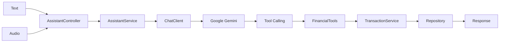

# FinVoice API

Assistente financeiro desenvolvido com Java, Spring Boot, Spring AI e Google Gemini.


## Sobre o projeto

FinVoice API é uma API financeira que permite cadastrar e consultar transações pessoais usando endpoints REST tradicionais e comandos interpretados por IA.

A ideia principal é transformar comandos como "gastei 45 reais no mercado" ou "qual é meu saldo atual?" em operações reais da aplicação. O Spring AI usa o `ChatClient` com Google Gemini para interpretar a intenção, escolher uma ferramenta com Tool Calling e executar a regra de negócio pelo mesmo serviço usado pelos endpoints REST.

Os dados são armazenados em H2 em memória. No ambiente demonstrativo, as informações são temporárias e podem ser perdidas quando o serviço reinicia.

## Desafio

O projeto foi desenvolvido para o desafio de Spring Boot com Spring AI da DIO, aplicando os conceitos de `ChatClient`, Tool Calling, validações, testes automatizados e separação entre IA e regra de negócio em uma API original de finanças pessoais.

## Minha evolução

- Comandos financeiros por texto
- Comandos financeiros por áudio multimodal
- Consulta de saldo
- Resumo financeiro geral
- Resumo por categoria
- Validações antes de salvar transações
- Resposta estruturada com o que foi interpretado
- Testes automatizados sem depender de chamadas externas

## Tecnologias

| Tecnologia | Uso |
| --- | --- |
| Java 21 | Linguagem principal |
| Spring Boot | Base da API |
| Spring AI | Integração com IA |
| Google Gemini API | Provider principal de IA |
| gemini-2.5-flash | Modelo de chat usado pela aplicação |
| ChatClient | Interpretação dos comandos |
| Tool Calling | Execução das ações financeiras |
| Spring Data JPA | Persistência |
| H2 Database | Banco em memória |
| Bean Validation | Validação dos DTOs |
| SpringDoc OpenAPI | Swagger |
| JUnit 5 | Testes |
| Mockito | Mocks |
| Docker | Container da aplicação |
| GitHub Actions | CI |
| Render | Deploy |

## Como a IA funciona



O fluxo principal usa texto com `ChatClient`, Gemini e Tool Calling. O endpoint `/assistant/audio` envia o arquivo de áudio ao Gemini como entrada multimodal quando a integração está configurada, mas não expõe uma transcrição literal separada. TTS não está disponível na integração Google GenAI usada pelo projeto e o endpoint de fala retorna `501 Not Implemented`.

## Modelo escolhido

O modelo configurado é `gemini-2.5-flash`, escolhido por estar disponível na integração oficial Google GenAI do Spring AI, oferecer suporte ao fluxo de Tool Calling e ser adequado para comandos simples em português. O projeto pode utilizar o nível gratuito da Gemini API conforme limites, disponibilidade e regras definidos pelo Google.

## Tool Calling

| Tool | O que faz |
| --- | --- |
| createExpense | Registra uma despesa |
| createIncome | Registra uma receita |
| getBalance | Consulta o saldo atual |
| getSummary | Consulta o resumo financeiro geral |
| getSummaryByCategory | Consulta o resumo por categoria |
| getRecentTransactions | Lista as últimas transações |

## Fluxo de exemplo

Comando:

```text
Gastei R$ 45 no mercado
```

A IA identifica:

| Campo | Valor |
| --- | --- |
| type | EXPENSE |
| amount | 45 |
| category | FOOD |
| description | mercado |

Depois disso, o Tool Calling aciona `createExpense`, a aplicação salva a transação e o usuário recebe uma confirmação curta.

## Endpoints

| Método | Endpoint | Descrição |
| --- | --- | --- |
| GET | `/actuator/health` | Health check |
| POST | `/transactions` | Cria uma transação manualmente |
| GET | `/transactions` | Lista transações |
| GET | `/transactions/{id}` | Busca transação por ID |
| DELETE | `/transactions/{id}` | Remove uma transação |
| GET | `/transactions/balance` | Consulta saldo |
| GET | `/transactions/summary` | Consulta resumo financeiro |
| GET | `/transactions/summary?category=FOOD` | Consulta resumo por categoria |
| POST | `/assistant/text` | Processa comando por texto |
| POST | `/assistant/audio` | Processa comando por áudio multimodal |
| POST | `/assistant/speech` | Retorna 501 porque TTS não está disponível |
| POST | `/assistant/audio/speech` | Retorna 501 porque TTS não está disponível |

## Exemplos

Criar transação manual:

```bash
curl -X POST http://localhost:8080/transactions \
  -H "Content-Type: application/json" \
  -d "{\"description\":\"Mercado\",\"amount\":45.00,\"type\":\"EXPENSE\",\"category\":\"FOOD\"}"
```

Enviar comando por texto:

```bash
curl -X POST http://localhost:8080/assistant/text \
  -H "Content-Type: application/json" \
  -d "{\"message\":\"Gastei 45 reais no mercado\"}"
```

Consultar saldo:

```bash
curl http://localhost:8080/transactions/balance
```

Consultar resumo:

```bash
curl http://localhost:8080/transactions/summary
```

## Áudio

O endpoint `/assistant/audio` recebe `multipart/form-data` com o campo `file`.

Formatos aceitos para demonstração:

- mp3
- mp4
- mpeg
- mpga
- m4a
- wav
- webm
- ogg

O arquivo precisa existir, não pode estar vazio e deve respeitar o limite de tamanho configurado. O áudio é enviado ao Gemini como entrada multimodal pelo `ChatClient`. O endpoint retorna a resposta interpretada pelo modelo, mas mantém `transcription` como `null` porque a implementação atual não usa um serviço separado de transcrição.

## Configuração da IA

Os endpoints REST financeiros, Swagger, health check, testes e build funcionam sem chave de IA.

Para usar os endpoints com Spring AI e Gemini, configure a variável de ambiente:

```env
GEMINI_API_KEY=sua_chave_aqui
```

Sem essa variável, os endpoints de IA retornam uma mensagem clara informando que o provider não está configurado. A chave deve ser configurada somente como variável de ambiente ou segredo do provedor de hospedagem. Nenhuma chave é versionada no repositório.

## Executando localmente

Windows:

```powershell
.\mvnw.cmd test
.\mvnw.cmd clean package
.\mvnw.cmd spring-boot:run
```

Linux/macOS:

```bash
./mvnw test
./mvnw clean package
./mvnw spring-boot:run
```

## Swagger

Local:

```text
http://localhost:8080/swagger-ui.html
```

Produção:

```text
https://finvoice-api-s0ah.onrender.com/swagger-ui.html
```

## Testes

Os testes cobrem:

- criação de transações
- validações de entrada
- busca por ID
- remoção
- saldo
- resumo financeiro
- resumo por categoria
- tools financeiras
- AssistantService com dependências de IA mockadas
- controllers REST
- multipart de áudio
- TTS não suportado pela integração atual

Comando:

```bash
./mvnw test
```

## Deploy

Aplicação:

```text
https://finvoice-api-s0ah.onrender.com
```

Swagger:

```text
https://finvoice-api-s0ah.onrender.com/swagger-ui.html
```

O deploy utiliza Docker e H2 em memória, sem banco externo.

## Docker

Build da imagem:

```bash
docker build -t finvoice-api .
```

Executar container:

```bash
docker run -p 8080:8080 finvoice-api
```

## Estrutura

```text
com.pedroteles.finvoice
├── ai
├── controller
├── dto
├── entity
├── enums
├── exception
├── repository
├── service
└── tool
```

## Segurança

A `GEMINI_API_KEY` é lida somente por variável de ambiente e não é versionada. Os testes automatizados não realizam chamadas reais para APIs externas e o CI não depende de credenciais.

## Aprendizados

Este projeto reforçou como integrar IA a uma aplicação com regras reais, mantendo as responsabilidades separadas. O `ChatClient` interpreta a intenção do usuário, o Gemini decide a ferramenta por Tool Calling e o serviço financeiro continua responsável por validar e salvar os dados.

## Entrega DIO

Desenvolvi a FinVoice API, um assistente financeiro utilizando Java, Spring Boot e Spring AI. A aplicação utiliza Google Gemini para interpretar comandos em linguagem natural e executar operações reais através de Tool Calling, como registrar transações, consultar saldo e gerar resumos financeiros. Também implementei validações, endpoints REST, testes automatizados e uma arquitetura organizada para separar a IA das regras de negócio.

Repositório:

```text
https://github.com/PedroseleT/finvoice-api
```

## Autor

Pedro Teles de Brito

GitHub: [PedroseleT](https://github.com/PedroseleT)

LinkedIn: [pedro-teless](http://www.linkedin.com/in/pedro-teless)
